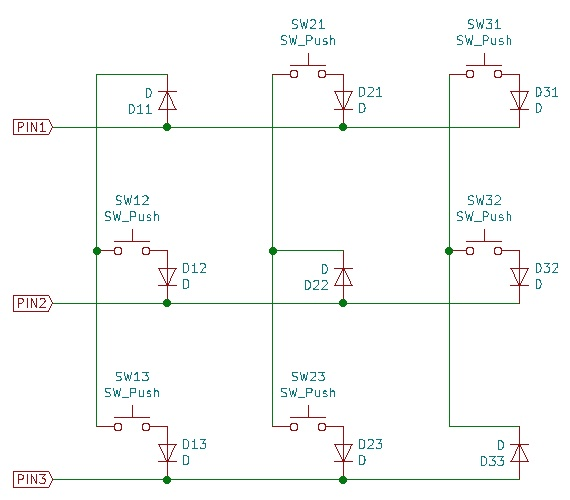

# charlieplex

A custom round-robin matrix that uses `n` GPIOs to provide a layout of `n*(n-1)` keys.

See https://github-com.translate.goog/jpskenn/SMK-Supplements/tree/master/RoundRobinMatrix?_x_tr_sl=ja&_x_tr_tl=en&_x_tr_hl=ja&_x_tr_pto=nui and https://github.com/jpskenn/Jones/issues/52 for more information.
