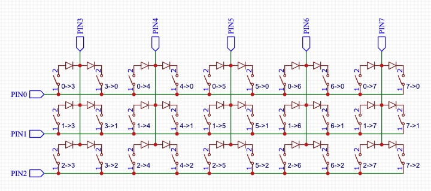

# duplex

A bi-directional ortho matrix that performs both `ROW2COL` and `COL2ROW` scan. It uses `m+n` GPIOs to provide a layout of `2*m*n` keys, twice of standard ortho matrix.

Duplex is a subset of Charlieplex.
